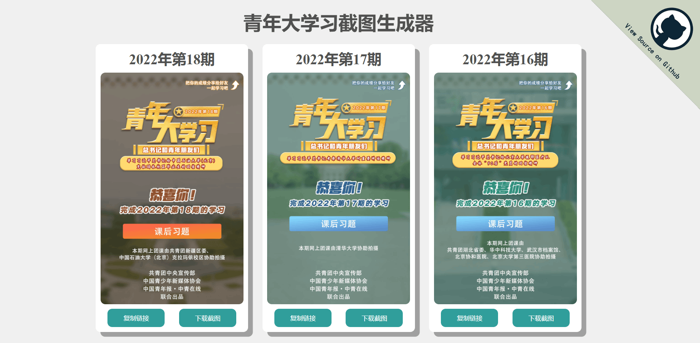

<h1>青年大学习截图生成器 </h1>

## 1. 预览



> Demo网址
> - [https://mr-addict.github.io/qndxx-screenshort-generator](https://mr-addict.github.io/qndxx-screenshort-generator)

## 2. 说明

本项目受Github众多有关青年大学习项目的启发，做这个项目也是觉得好玩，简单但是锻炼能力。

本项目使用Python抓取网页链接，使用`GitHub Action`在每周一的上午12点多自动更新，同时会将抓取结果部署在`GitHub Pages`上。

进入项目部署的网址会显示抓取的`最多15张`大学习截图，同时每期的大学习截图下方有两个按钮，复制按钮用于复制原始的大学习截图链接，如果你需要的话；下载按钮用于下载这一期的大学习截图。

> 本项目受到启发的项目
> - [https://github.com/UniverseLover/FuckQNDXX](https://github.com/UniverseLover/FuckQNDXX)

## 3. 基本原理

本项目的原理非常简单

- 第一步：从[中青在线](http://news.cyol.com/gb/channels/vrGlAKDl/index.html)抓取最新的大学习链接
- 第二步：将获取的链接尾的`m.html`或`m2.html`替换成`images/end.jpg`即为这一期的大学习结束的截图链接

> 青年大学习也是可以使用脚本的，有基础的同学可以参考这个项目，里面有详细介绍大学习的原理
> - [https://github.com/yuzaii/JsQndxx_Python](https://github.com/yuzaii/JsQndxx_Python)

## 4. 如何自己部署

第一步，克隆本文档：

```bash
git clone https://github.com/MR-Addict/qndxx-screenshort-generator.git
```

第二步：安装python依赖：

```bash
pip install -r requirements.txt
```

第三步：运行python脚本：

```bash
python main.py
```

这一步会生成一个`public`文件夹，也就是最终的网页文档了。

第四步：搭建web服务器

```bash
python -m http.server 8080 --directory public
```

## 5. 结束

Happy coding！